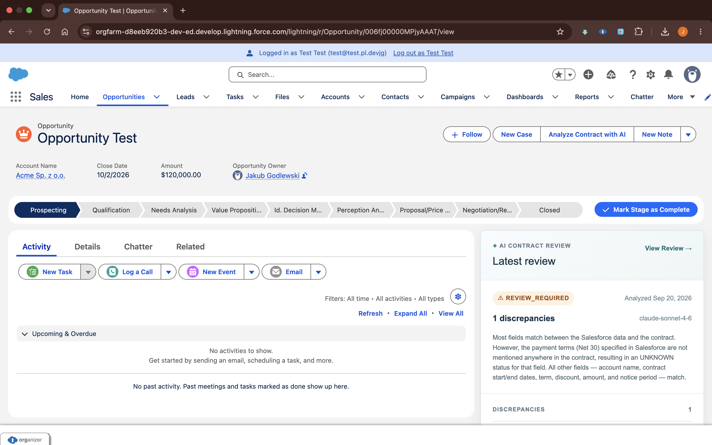
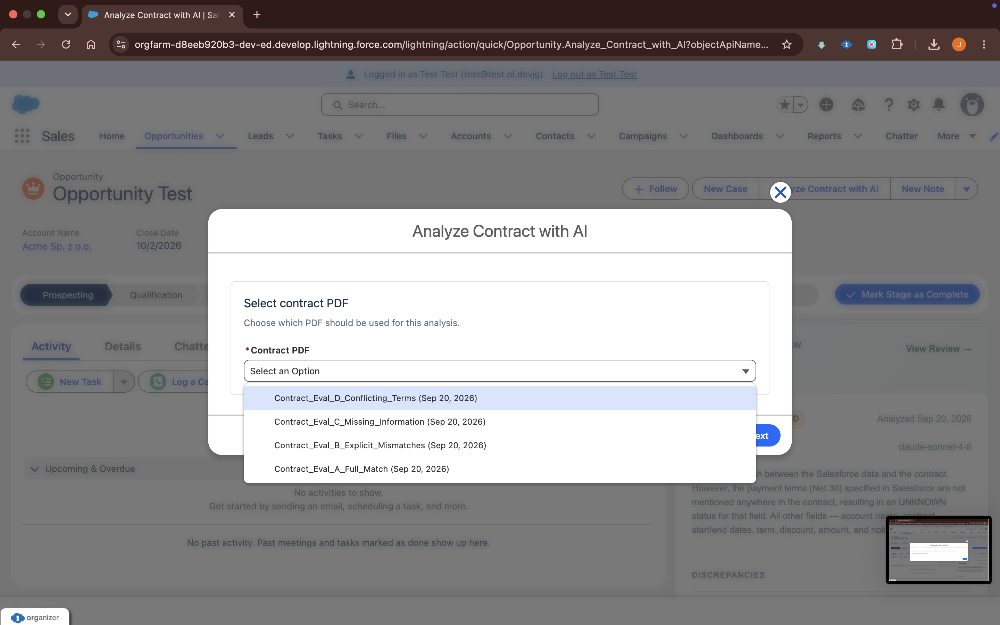
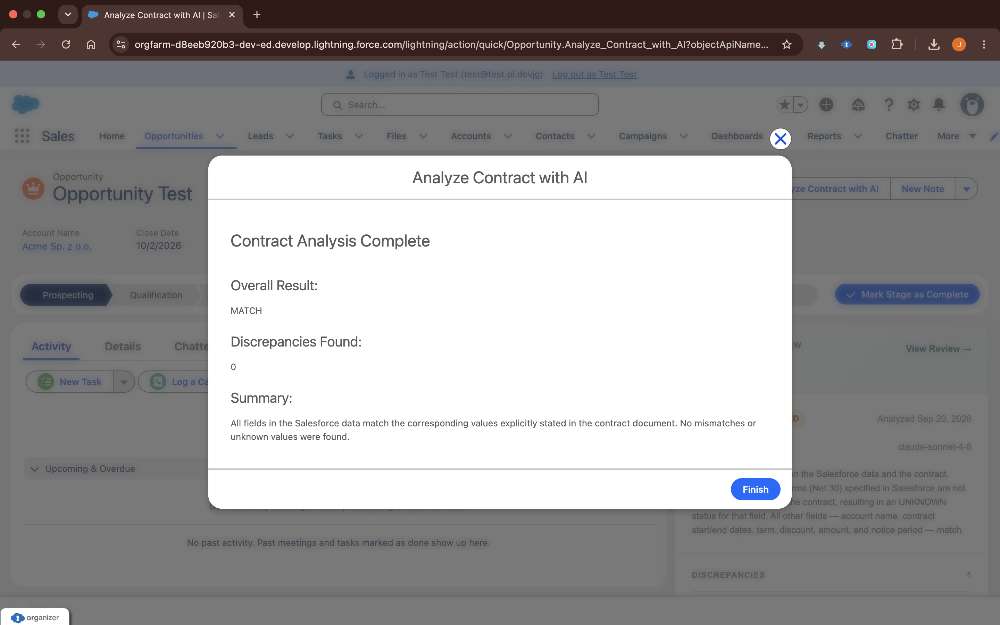
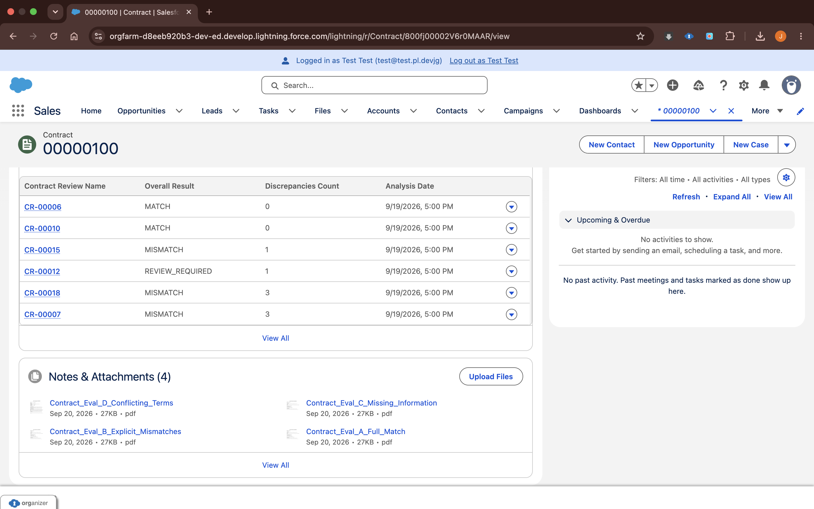
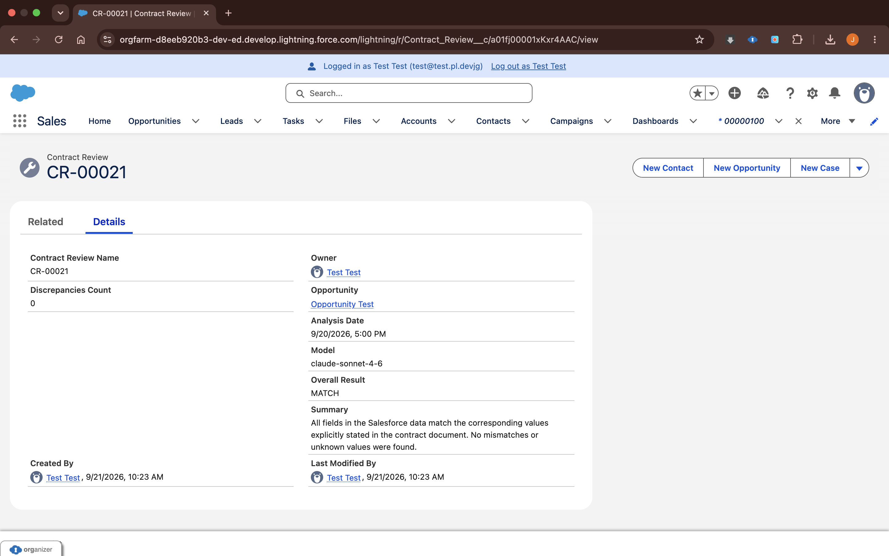

# Salesforce AI Contract Review

A Salesforce proof of concept that uses **Anthropic Claude** to review contract PDFs and compare contractual terms with structured Salesforce data.

The project demonstrates an end-to-end GenAI use case built natively on the Salesforce Platform using **Apex, Lightning Web Components, Salesforce Flow, Salesforce Files, Named Credentials, External Credentials, and Custom Metadata**.

> **Status:** Technical Proof of Concept / Portfolio Project  
> All contracts and evaluation data included in this repository are synthetic.

---

## Overview

Commercial contract information often exists in two different forms:

- structured business data stored in Salesforce,
- unstructured contractual language stored in PDF documents.

Those sources can diverge. A contract may contain a different amount or discount than Salesforce, omit a term entirely, or contain conflicting provisions that require human review.

This project uses Claude to interpret the unstructured document while Salesforce remains responsible for security, validation, deterministic business rules, persistence, and the user experience.

### High-Level Process

```text
Opportunity + Contract
        |
        +-- Structured Salesforce data
        |
        +-- Selected contract PDF
        |
        v
Contract Analysis Service
        |
        v
Anthropic Claude
        |
        v
Structured field-level comparison
        |
        v
Apex validation
        |
        v
Deterministic overall result
        |
        v
Contract Review + Discrepancies
        |
        v
Opportunity UI
```

---

## Demo

The latest analysis is displayed directly on the Opportunity.



In this example, Claude identified that the contract did not contain the payment terms stored in Salesforce. The field was classified as `UNKNOWN`, causing Apex to calculate the overall result as `REVIEW_REQUIRED`.

---

## User Flow

The analysis is launched from the Opportunity using the **Analyze Contract with AI** Screen Flow.

The user selects the exact PDF to analyze from the files associated with the related Contract.



After the analysis completes, the Flow displays the deterministic overall result, number of discrepancies, and summary.



The analysis is then persisted in Salesforce and remains available after the Flow has finished.

---

## Architecture

The application separates probabilistic AI responsibilities from deterministic Salesforce responsibilities.

```text
Opportunity
    |
    +-- Amount
    +-- Discount
    +-- Payment Terms
    +-- Notice Period
    +-- Account
    |
    v
Contract
    |
    +-- Start Date
    +-- End Date
    +-- Contract Term
    |
    v
Salesforce Files / ContentVersion
    |
    v
Screen Flow
    |
    +-- Contract PDF Selector LWC
    |
    v
ContractAnalysisAction
    |
    v
ContractAnalysisService
    |
    +-- ContractContextService
    +-- ContractFileService
    +-- ClaudeClient
    |
    v
Named Credential
    |
    v
External Credential
    |
    v
Anthropic Messages API
    |
    v
Structured JSON
    |
    v
Apex Validation
    |
    v
Deterministic Overall Result
    |
    v
Contract_Review__c
    |
    +-- Contract_Discrepancy__c
    |
    v
contractReviewPanel LWC
```

---

## Technology Stack

| Area | Technology |
| --- | --- |
| Platform | Salesforce |
| Backend | Apex |
| UI | Lightning Web Components |
| Orchestration | Salesforce Flow |
| Documents | Salesforce Files / ContentVersion |
| GenAI | Anthropic Claude |
| Integration | REST / Anthropic Messages API |
| Authentication | Named Credential + External Credential |
| AI Configuration | Custom Metadata |
| Persistence | Salesforce Custom Objects |
| Security | Sharing + Permission Sets |
| Unit Testing | Apex + HttpCalloutMock |
| Source Control | Git / Salesforce DX |

---

## Data Used for Comparison

The AI receives a deliberately limited set of business fields.

### Opportunity

```text
accountName
amount
discount
paymentTerms
noticePeriodDays
```

### Contract

```text
contractStartDate
contractEndDate
contractTermMonths
```

Technical identifiers are used internally by Salesforce but are not treated as business terms to compare.

---

## AI Classification Model

Claude classifies every business field independently.

| Status | Meaning |
| --- | --- |
| `MATCH` | Salesforce and the contract contain equivalent definitive values |
| `MISMATCH` | Salesforce and the contract contain conflicting definitive values |
| `UNKNOWN` | The contract does not contain the information required for comparison |
| `AMBIGUOUS` | Relevant information exists, but the contract does not establish one definitive value |

The distinction between `MISMATCH`, `UNKNOWN`, and `AMBIGUOUS` is intentional.

For example, the absence of payment terms is not the same as a contract explicitly containing different payment terms.

Likewise, conflicting contractual provisions should not be reduced to a simple mismatch if the document itself does not establish which value controls.

---

## Deterministic Overall Result

Claude interprets individual contract terms, but it does **not** decide the final Salesforce review result.

Apex calculates the aggregate result:

```text
If any comparison is MISMATCH
    -> MISMATCH

Else if any comparison is UNKNOWN or AMBIGUOUS
    -> REVIEW_REQUIRED

Else
    -> MATCH
```

This creates a clear boundary between probabilistic interpretation and deterministic business logic.

---

## Structured AI Response

Claude is instructed to return structured JSON.

A comparison can look like this:

```json
{
  "field": "discount",
  "salesforceSource": "Opportunity",
  "salesforceValue": "10%",
  "contractValue": "15%",
  "status": "MISMATCH",
  "severity": "MEDIUM",
  "confidence": 0.99,
  "contractEvidence": "The Customer receives a discount of 15%.",
  "explanation": "The contract establishes a 15% discount while Salesforce records 10%."
}
```

The response is deserialized into typed Apex DTOs before it can be used by the rest of the application.

---

## AI Response Validation

Model output is treated as **untrusted input**.

Before persistence, Apex validates the response, including:

- required comparison data,
- supported comparison statuses,
- supported severity values,
- confidence values between `0` and `1`,
- expected response structure,
- allowed comparison fields.

Malformed or unsupported responses are rejected instead of being silently stored.

```text
Claude Response
      |
      v
Untrusted JSON
      |
      v
Apex DTO
      |
      v
Validation
      |
      v
Deterministic Rules
      |
      v
Persistence
```

---

## Prompt and Model Configuration

Prompt configuration is stored in the `AI_Prompt_Config__mdt` Custom Metadata Type rather than hard-coded in Apex.

The configuration contains:

- active status,
- model,
- maximum output tokens,
- prompt,
- prompt version.

The current configuration uses:

```text
claude-sonnet-4-6
```

Keeping the prompt in metadata makes it possible to evolve AI behavior independently from the integration code.

---

## Persistence and Audit Trail

Each successful analysis creates a `Contract_Review__c` record.

Individual comparisons requiring attention are persisted as `Contract_Discrepancy__c` records.

`MATCH` comparisons are not stored as discrepancies.

The related Contract therefore retains both its source documents and the history of AI review executions.



A persisted review contains the model, analysis date, overall result, discrepancy count, summary, and relationships to the source Salesforce records.



This makes the analysis auditable inside Salesforce rather than leaving the model response as temporary UI output.

---

## Security

### Record Access

Core application services use Salesforce sharing rules, so access to the AI functionality does not intentionally bypass record-level access to the underlying business records.

### Permissions

Dedicated permission sets and permission set groups provide the access required by the application.

The intended user can access the required Opportunity, Account, Contract, Salesforce Files, Apex, Flow, review records, and configured External Credential principal.

### API Secret

The Anthropic API key is not stored in Apex, Flow, Custom Metadata, or source control.

Authentication is handled through Salesforce:

```text
Named Credential
      |
      v
External Credential
      |
      v
Named Principal
      |
      v
Secret stored in Salesforce
```

The repository contains credential configuration metadata but not the actual API key.

---

## Error Handling

The solution handles failures such as:

- missing Opportunity,
- missing related Contract,
- missing or unavailable PDF,
- invalid PDF selection,
- Anthropic authentication errors,
- API rate limiting,
- external server errors,
- malformed Anthropic responses,
- malformed model JSON,
- truncated model output,
- unsupported status values,
- unsupported severity values,
- invalid confidence values.

The Screen Flow includes a fault path so failures are surfaced to the user instead of silently creating incomplete analysis records.

---

## Testing

The project contains Apex tests for the main application layers.

Coverage includes:

- contract context retrieval,
- Salesforce File discovery and selection,
- Anthropic request construction,
- PDF request payloads,
- successful API responses,
- HTTP error responses,
- malformed responses,
- malformed model JSON,
- truncated model output,
- comparison validation,
- deterministic overall-result calculation,
- review persistence,
- discrepancy persistence,
- restricted-user record access.

External HTTP responses are mocked with `HttpCalloutMock`, keeping the Apex unit tests deterministic and independent of Anthropic API availability.

---

## LLM Evaluation

Unit tests can verify application code, but mocked HTTP responses cannot prove that the real language model interprets contractual language correctly.

The repository therefore contains a separate evaluation suite using synthetic contracts and the real Claude integration.

### Evaluation Baseline

```text
Customer: Acme Sp. z o.o.
Amount: USD 120,000
Discount: 10%
Payment Terms: Net 30
Notice Period: 60 days
Contract Start: 2026-11-01
Contract End: 2027-10-31
Contract Term: 12 months
```

### Final Evaluation

| Scenario | Expected Result | Expected Issue | Result |
| --- | --- | --- | --- |
| A - Full Match | `MATCH` | None | PASS |
| B - Explicit Mismatches | `MISMATCH` | Amount, Discount, Notice Period | PASS |
| C - Missing Information | `REVIEW_REQUIRED` | Payment Terms -> `UNKNOWN` | PASS |
| D - Conflicting Terms | `REVIEW_REQUIRED` | Discount -> `AMBIGUOUS` | PASS |

The evaluation also influenced the architecture.

During the missing-information scenario, Claude correctly classified the individual payment terms comparison as `UNKNOWN`, while its aggregate classification was inconsistent with the field-level result.

The aggregate decision was therefore moved out of the LLM and into deterministic Apex logic.

The final A-D regression suite passed with that architecture.

For the full methodology, scenarios, findings, and test documents, see:

**[LLM Evaluation](evaluation/README.md)**

Synthetic evaluation documents are stored in:

```text
evaluation/synthetic-contracts/
```

---

## Unit Tests vs LLM Evaluation

The project deliberately separates two different testing concerns.

**Apex unit tests** verify deterministic software behavior:

```text
request construction
JSON parsing
validation
business rules
persistence
security behavior
error handling
```

**LLM evaluation** verifies model behavior:

```text
contract interpretation
semantic comparison
missing information
conflicting provisions
classification behavior
```

Neither replaces the other.

---

## What Claude Does

Claude is responsible for:

- reading unstructured contract content,
- extracting relevant contractual information,
- interpreting whether contract language is definitive or ambiguous,
- comparing contract terms with supplied Salesforce values,
- producing evidence and explanations,
- returning structured field-level classifications.

## What Salesforce Does

Salesforce is responsible for:

- record access,
- file access,
- structured data retrieval,
- authentication,
- API orchestration,
- response validation,
- deterministic aggregation,
- persistence,
- authorization,
- user interaction.

The architecture therefore uses AI where semantic interpretation is required while keeping deterministic controls inside Salesforce.

---

## Repository Structure

```text
salesforce-ai-contract-review/
├── README.md
├── docs/
│   └── screenshots/
│       ├── analysis-result-match.png
│       ├── contract-files-and-reviews.png
│       ├── contract-pdf-selection.png
│       ├── contract-review-record.png
│       └── opportunity-review-required.png
├── evaluation/
│   ├── README.md
│   └── synthetic-contracts/
│       ├── Contract_Eval_A_Full_Match.pdf
│       ├── Contract_Eval_B_Explicit_Mismatches.pdf
│       ├── Contract_Eval_C_Missing_Information.pdf
│       └── Contract_Eval_D_Conflicting_Terms.pdf
├── force-app/
│   └── main/
│       └── default/
│           ├── classes/
│           ├── customMetadata/
│           ├── externalCredentials/
│           ├── flows/
│           ├── lwc/
│           ├── namedCredentials/
│           ├── objects/
│           ├── permissionsets/
│           └── permissionsetgroups/
├── config/
├── scripts/
├── package.json
└── sfdx-project.json
```

---

## Setup

### Prerequisites

- Salesforce CLI
- access to a Salesforce org
- an Anthropic API key
- permission to deploy the required Salesforce metadata

### 1. Authenticate to Salesforce

```bash
sf org login web --alias contract-review
```

### 2. Deploy the Salesforce Metadata

```bash
sf project deploy start   --source-dir force-app   --target-org contract-review
```

### 3. Configure the Anthropic Credential

The API secret is intentionally excluded from the repository.

After deployment:

1. Open **Setup -> Named Credentials**.
2. Locate the Anthropic External Credential.
3. Configure the Named Principal authentication parameter with a valid Anthropic API key.
4. Ensure the application user has access to the External Credential principal.

### 4. Assign Permissions

Assign the appropriate project permission set or permission set group to the user.

### 5. Prepare Data

Create an Opportunity with a related Contract containing the required comparison fields.

Upload at least one PDF to the related Contract using Salesforce Files.

### 6. Run the Analysis

Open the Opportunity, launch **Analyze Contract with AI**, select the contract PDF, and start the analysis.

---

## Running Apex Tests

```bash
sf apex run test   --test-level RunLocalTests   --target-org contract-review   --wait 20   --code-coverage
```

The Apex test suite uses mocked HTTP responses and does not require live Anthropic API calls.

---

## Production Considerations

This repository is intentionally a technical proof of concept.

A production implementation would require additional decisions based on organizational requirements, including:

- legal and compliance review,
- contract confidentiality requirements,
- data residency,
- AI provider data-processing policies,
- observability and operational monitoring,
- API cost monitoring,
- retry and rate-limit strategies,
- asynchronous processing for larger workloads,
- prompt and model lifecycle management,
- expanded LLM evaluation datasets,
- regression testing across model versions,
- human review and escalation workflows,
- audit and retention policies.

AI-generated results should be treated as decision support rather than a substitute for legal review.

---

## Design Principles

**AI output is untrusted input.**  
Model responses are validated before they affect Salesforce data.

**Use AI for semantic interpretation.**  
Claude interprets unstructured contract language; Apex handles deterministic business logic.

**Missing information is not a mismatch.**  
`UNKNOWN`, `AMBIGUOUS`, and `MISMATCH` represent different situations.

**Keep aggregate decisions deterministic.**  
Claude classifies individual fields; Apex determines the overall review result.

**Keep secrets outside source code.**  
API authentication is handled through Salesforce credentials.

**Respect Salesforce security.**  
The AI integration should not become a mechanism for bypassing record access.

**Test both code and model behavior.**  
Apex unit tests are complemented by document-level LLM evaluation.

---

## Disclaimer

This repository is a technical proof of concept created for demonstration and learning purposes.

All contract examples and evaluation data are synthetic.

The project is not a legal review system, and AI-generated analysis should not be treated as legal advice.

---

## Author

**Jakub Godlewski**  
Salesforce Developer / Technical Lead

Built as a hands-on exploration of integrating Generative AI with Salesforce using native platform architecture, security controls, deterministic guardrails, and LLM evaluation.
